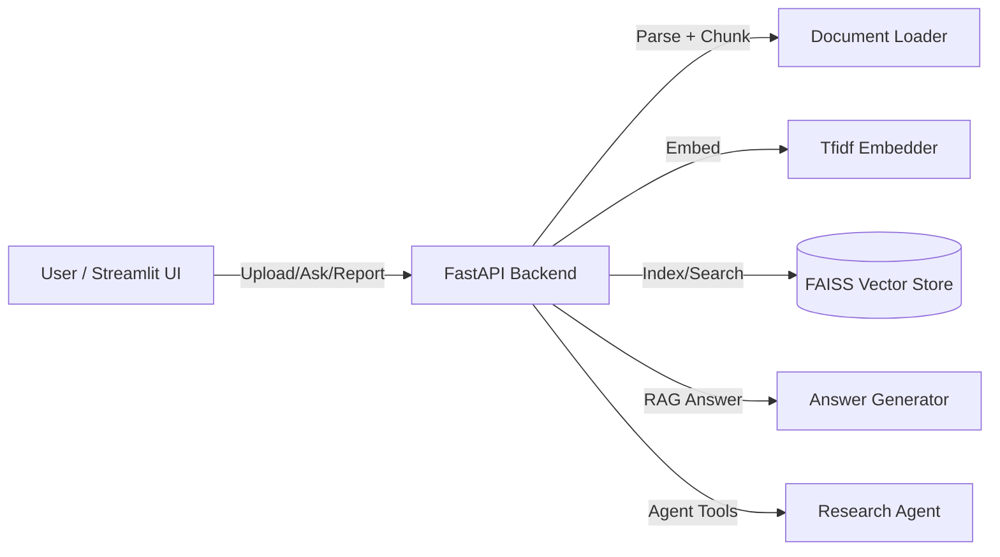

# BioMed Research Agent Demo

一个可运行的端到端RAG演示项目：上传PDF/Markdown → 构建向量索引 → RAG问答 → Agent输出“POC交付报告”。

## 架构图



## 快速开始

### 本地运行

```bash
python -m venv .venv
source .venv/bin/activate
pip install -r requirements.txt

uvicorn backend.app.main:app --reload --host 0.0.0.0 --port 8000
```

另开终端运行前端：

```bash
streamlit run frontend/app.py
```

### Docker 一键启动

```bash
docker compose up --build
```

访问：
- FastAPI: http://localhost:8000/docs
- Streamlit: http://localhost:8501

## 演示脚本

1. 打开 Streamlit 页面。
2. 上传 PDF/Markdown 文档。
3. 点击“开始索引”。
4. 输入问题并点击“提交问题”。
5. 点击“生成报告”导出 POC 交付报告。

## POC 评估指标

- **响应时延**：`/ask` & `/agent/run` 的平均响应时间。
- **命中率**：检索结果中包含目标关键词或主题的比例。
- **引用覆盖**：回答中引用片段的覆盖率（引用数量/总检索片段数）。

## 目录结构

```
.
├── backend
│   └── app
│       ├── main.py
│       ├── config.py
│       ├── schemas.py
│       └── services
├── frontend
│   └── app.py
├── tests
├── docker-compose.yml
├── Dockerfile
└── README.md
```
